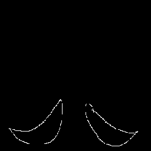

# Generative-based Weakly Supervised Semantic Segmentation
This repository is under development.

## Dataset
This project includes three datasets.

### In-House - Australian IPF Registry (AIPFR) Dataset
This dataset comprises Chest HRCT scans from 227 patients and includes cases of fibrosis. No annotation or lables.

**Processed**: 
- Pre-processing pipeline: yingying completed
- Filter Selection: Only contains slices bewteen top and end slices of lung. The top and last slices are selected based on a minimum lung area of 400(to be removed after re-training of U-Net) pixels.
- 64495 2D slices included
    
  ```
  cd scr
  python preprocess_AIPFR.py
  ```

### In-House - OSIC Firbosis Dataset
**Annotated Source File Location**  
📂 `/media/NAS04/yyxxxx/prognostic_result/dataset/data_fibrosis/annotation_all`

**Preprocessed Size350 Slices File Location**  
📂 `/media/NAS04/yyxxxx/prognostic_result/dataset/data_fibrosis/gavin/slice_select`  
--> Now stored at `data/OSIC/preprocessed_size350`

- `fibrosis_selected`
- `no_fibrosis_selected`
- `no_fibrosis_covid`

**Final Processed Size256 Slices File Location**  
📂 `data/OSIC/processed`  
processing python file: `data/OSIC/scripts/processing_fibrosis.py`
```
This script processes fibrosis images from the preprocessed OSIC dataset (size: 350x350).
The processed images will be resized to 256x256 and saved in the directory:
    data/OSIC/processed/fibrosis
```

**Raw Preprocess and Location**
Original preprocessing file: `preprocess_OSIC.py`   
Modified from orginal: `preprocess_COVID.py`, `preprocess_YYF30Case.py`
- windowing: `min_value=-1024, max_value=-100`
- `preprocess_YYF30Case.py` will preprocess raw file, including masking, filtering lung slices, and finally resize to 256 using `LANCZOS`
- old `preprocess_OSIC.py` only resize to 350 using cv2.INTER_AREA, not accurate and need futher preprocessing `data/OSIC/scripts/processing_fibrosis.py` to resize to 256

**GT Process and Location**  
The original fibrosis label is an annotation, which is converted to a segmentation mask through processing.
- **`fibrosis_gt`**:  
  The ground truth (GT) annotation is processed and converted into a filled segmentation mask.  
  **Note**: Code for this process is yet to be added.  
  Try to use new kernel `kernel = cv2.getStructuringElement(cv2.MORPH_ELLIPSE, (5, 5))`

- **Annotation Issues**:  
  Some clinician-made errors (e.g., annotations not closed or continuous) in the original annotations result in segmentation masks that are not properly closed or filled.  
  - **Case 33**: Annotated by clinician **Tiru**, contains more errors compared to others.  
  - **Case 34**: Less, a few failed slices. e.g. `034_fibrosis_061_mask.png`
  - **Other Cases**: No significant issues found.

  Additionally, some clinicians tend to mark larger annotations (e.g., Cases 33 and 34), while some tend to mark very small annotations.

- **Example**:  
  Below are examples of segmentation masks with errors:  
<figure style="display: flex; justify-content: space-between;">
    <div style="text-align: center;">
        
        <figcaption>Annotation: 033_fibrosis_044</figcaption>
    </div>
    <div style="text-align: center;">
        
        <figcaption>Mask: 033_fibrosis_044</figcaption>
    </div>
    <div style="text-align: center;">
        
        <figcaption>Annotation: 033_fibrosis_119</figcaption>
    </div>
    <div style="text-align: center;">
        
        <figcaption>Mask: 033_fibrosis_119</figcaption>
    </div>
</figure>

**Original Slice Name Track Record**  
The processed slices are saved with randomized names in the format `orig_xxxxx.png`.  
The corresponding original names can be found in the record file: `data/OSIC/origname_record_fibrosis.csv`.

**Patient & Annotation Overview**  
- **51 patients**  
- **Annotated by 4 doctors**

| Doctor Name  | Total Cases | Case IDs |
|-------------|------------|----------------------------------------------------|
| **Tiru**    | 2          | 33, 34 |
| **Sean**    | 19         | 127-129, 131-132, 134-141, 143, 145-149 |
| **Sivandan** | 11        | 192-201, 203 |
| **Yakup**   | 21         | 64-84 |

**Processed**: 
- **51 patients**  
- **Total slices: 15,316**
  - **Annotated fibrosis slices**: 12,625  
  - **Non-fibrosis slices**: 2,691  

### Open Souce - Kits23 Dataset
contains kidney, tumour, etc... Masks for each elements.

## Inference
**WSSS_Unet**:
- `src/infer_wsss_unet_OSIC.py` and `infer_wsss_unet_YYF30Case.py`
- `Pytorch_UNet.unet` is a dependency


## Results
Results are saved in the `experiments` directory under each model's folder.

**Models**: We have evaluated the performance of three segmentation models:
1. fully_supervised_unet
2. wsss_coin
3. wsss_unet

Each model has **segmentation results & quantitative results**.

- Segmentation results are saved under `/model_name/results/dataset_name/pred_mask/`.
- Quantitative results are saved under `/model_name/results/dataset_name/quant/`.

Quantitative results contain:
- 2D information for each slice
- 3D information for each case

**Visualisation**
- 2D Vis: Use file `notebooks/labels_vis.ipynb` to compare img, GT, preds etc and save as fig at `experiments/wsss_unet/results/YYF_30Case/imgs_vis`
- 3D Vis: Use file `notebooks/3d_convert.ipynb` to convert 2d slices (`pred_masks` inferred from different models) back to `.nii.gz`.  
  3d files saved at 
  - `experiments/wsss_unet/results/OSIC/3d_visual`
  - `experiments/wsss_unet/results/YYF_30Case/preprocessed_size256/3d_visual`

## Utilities
- `utils/ct2imgs.py` is used to read `.nii.gz` CT file and save as `2d slices`
- `utils/save_nii.py` is used to convert `2d slices` back to `3d CT` for visulisation.  
  `notebooks/3d_convert.ipynb` is depend on `utils/save_nii.py`.

### Project Directory Structure

The following is the directory structure of the project, showcasing the organization of files and folders:
```plaintext
my-repo/
├── .github/
│   └── workflows/
│       └── pylint.yml
├── data/
│   └── OSIC/
│       └── scripts/
│           ├── get_random_name_OSIC.py
│           └── processing_fibrosis.py
├── src/
│   └── preprocess_AIPFR.py
├── requirements.txt
└── README.md